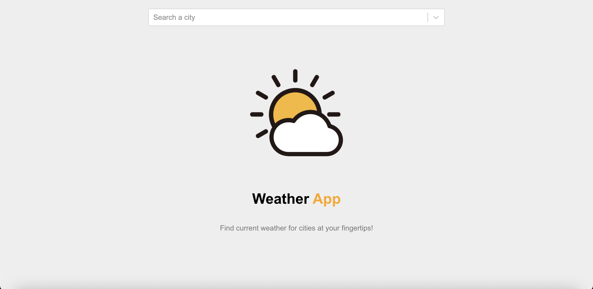

# Weather Application

 

A weather application built with React.js.

Fully responsible to any screen sizes.

https://react-weather-app-danielkim2711.vercel.app

<h3>:star: List of Used Third Party APIs</h3>

<a href="https://rapidapi.com/wirefreethought/api/geodb-cities">GeoDB Cities</a>

 

<a href="https://openweathermap.org">OpenWeatherMap</a>
